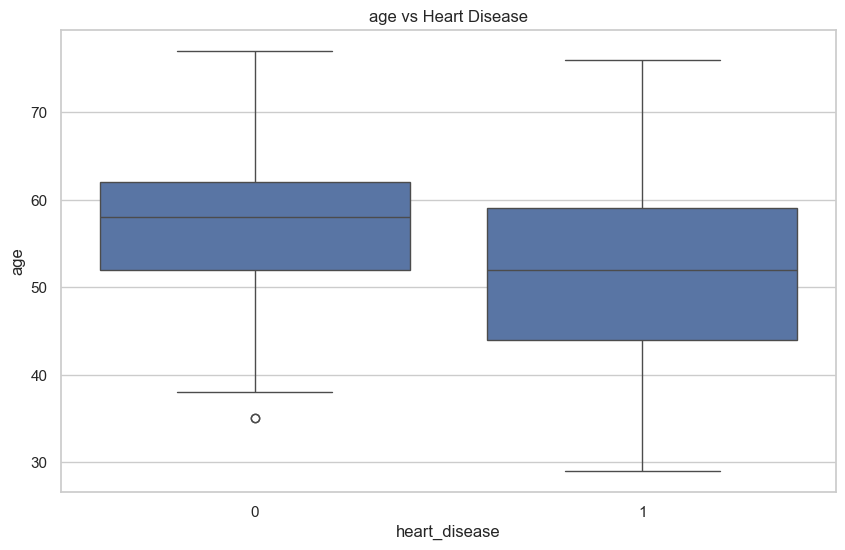

# Heart Disease Exploratory Data Analysis (EDA)

## 📌 Project Overview

This project performs an exploratory data analysis (EDA) on a heart disease dataset
to understand the distribution of clinical features and uncover relationships
associated with the presence of heart disease.

The analysis focuses on data quality checks, univariate and bivariate analysis,
and correlation exploration to generate meaningful insights that can inform
future predictive modeling.

---

## 📂 Dataset

- **Source:** UCI Heart Disease Dataset
- **Observations:** Patient-level medical records
- **Target Variable:** Presence of heart disease (`heart_disease`)

---

## 🛠 Tools & Libraries
- Python
- Pandas
- NumPy
- Matplotlib
- Seaborn

---

## 🔍 Key Analysis Steps

- Data loading and inspection
- Feature renaming for readability
- Data quality checks (missing values, duplicates)
- Univariate analysis of numerical and categorical features
- Bivariate analysis against the target variable
- Correlation analysis of numerical features

---

## 📊 Key Insights

- Chest pain type shows a strong association with heart disease.
- Patients with lower maximum heart rate tend to have a higher risk of heart disease.
- ST depression (`st_depression`) is positively correlated with heart disease.
- No severe multicollinearity was observed among numerical features.

---

## 📊 Key Visualizations


### Age vs Heart Disease


### Correlation Heatmap




---

## ▶️ How to Run

1. Clone the repository
2. Install dependencies:

   ```bash
   pip install -r requirements.txt
